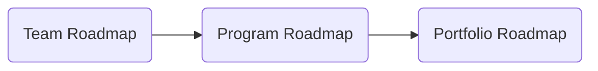

>[!info]
>Portfolio roadmaps differ from program (ART) roadmaps, and team-level roadmaps, though it may include information from them. Due to type of horizon planning and higher-level detail the portfolio roadmap is a 'big picture' view for communication to the enterprise and stakeholders.

# What is a Portfolio Roadmap?
Think of the portfolio roadmap as the visual that shows the path to the future state. The roadmap must be flexible as long-term commitments decrease the agility of the organization. 

## Visualizing the Relationship to Other Roadmaps

