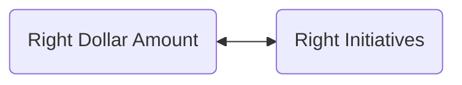

## What is the Goal of Strategy and Investment Funding?
The goal is simple, to allocate the right investments to create the right things. That is the way to accomplish your ultimate [[Business Objectives]] as an organization. 

To make the right investments your portfolio (meaning roles, structures, and processes) must understand it's role in the strategy of the enterprise as a whole. Leverage [[systems thinking]] and go beyond individual teams, clients, or departments. 

## What Kinds of Responsibilities Fall Into Strategy and Investment Funding?
- [[Connecting the Portfolio to the Enterprise Strategy]] 
- [[Maintaining a Portfolio Vision]]
- [[Realize Portfolio Vision Through Epics]] 
- [[Establish Lean Budgets and Guardrails]] 
- [[Establish Portfolio Flow]] 

## Who Participates in Strategy and Investment Funding?
The roles below all collaborate in strategy and investment funding. 
- [[Enterprise Architects]]
- [[Business Owners]] 
- [[Enterprise Executives]]

# References
[SAFe - Lean Portfolio Management](https://www.scaledagileframework.com/lean-portfolio-management/)
